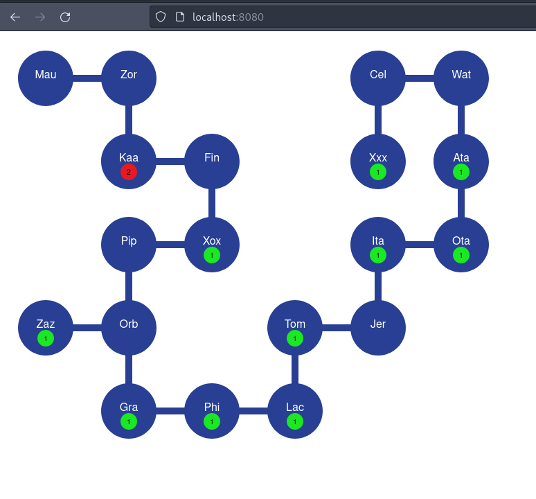
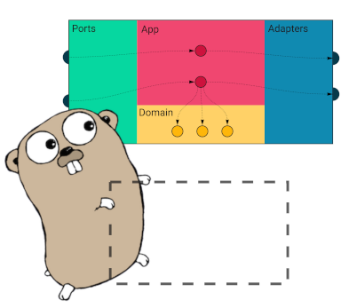

# Alien Invasion simulator

This simulator implements the requirements defined in [Alien Invasion spec](docs/AlienInvasion.pdf).

#### Extra:

It also includes an experimental HTTP service where the user can render the world map.



## Requirements

- Go compiler with modules support ( > 1.11 )
- GNU make or similar

## Build

```
make
```

## Run tests

```
make test
```

## Run lints

```
make lint
```

## Usage

```
./cmd/alien_invasion [OPTIONS] <num aliens>

OPTIONS:
-------

-f <map file name>  (default `./world.map`) # Map filename path
-t <tick interval in ms>  (default `100`) # Pause between moves ( 0 to disable )
-m <max moves> (default `10000`) # Max number of moves
-a <http service address> (default `:8080`) # HTTP service address:port (-1 to disable http )
```

Example
9 aliens, max of 10 moves, with 2000 ms tick

```
./cmd/alien_invasion -m 10 -t 2000 9
```

(Open browser on `http://localhost:8080` to display the map).

After the 10 moves the final map will be written with a format like `2022-11-22T12:53:16-03:00.map`


## Assumptions

- Each city can have a maximum of 4 roads ( North, East, South and West ) and each direction is unique ( e.g: is not possible to have two East roads )

- All roads connects two cities in both directions ( e.g if Foo city have an East road to Bar city, then Bar city have a West road connecting to Foo city )

- All cities are initially connected in some way, there are not isolated cities or groups of connected cities

## Architecture

This repository uses a clean architecture pattern, with four layers:



#### Adapters

An adapter is how the application talks to third party services or access OS resources (e.g. SQL queries, HTTP or gRPC clients, file readers and writers, Pub/Sub message publishers).

#### Ports

A port is an input to the application, and the only way the external world can reach it. (e.g. HTTP or gRPC server)

#### App

The application logic is a thin layer that “glues together” other layers. It’s also known as “use cases”.

#### Model

A domain layer that holds just the business logic.

[More details about clean architecture](https://threedots.tech/post/introducing-clean-architecture/)

## Implementation

### Models (domain)

```

City
Alien

```

### App (use cases)

- Read map from file
- Render aliens
- For each move (max. 10k)
  - Move aliens
  - If fight detected
    - Remove alien
    - Remove city
    - exit if all aliens were destroyed
- Write map to file

### Adapters

- World state manager
- SVG map renderer

### Ports

#### HTTP

##### Endpoints

- `GET /` Renders a world map. ( will refresh every second)
- `GET /map` Returns a SVG map
